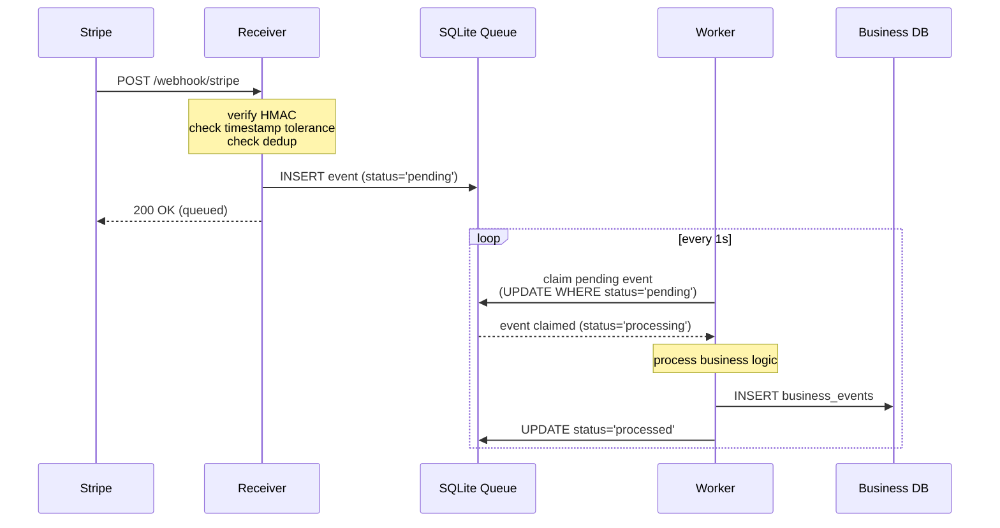
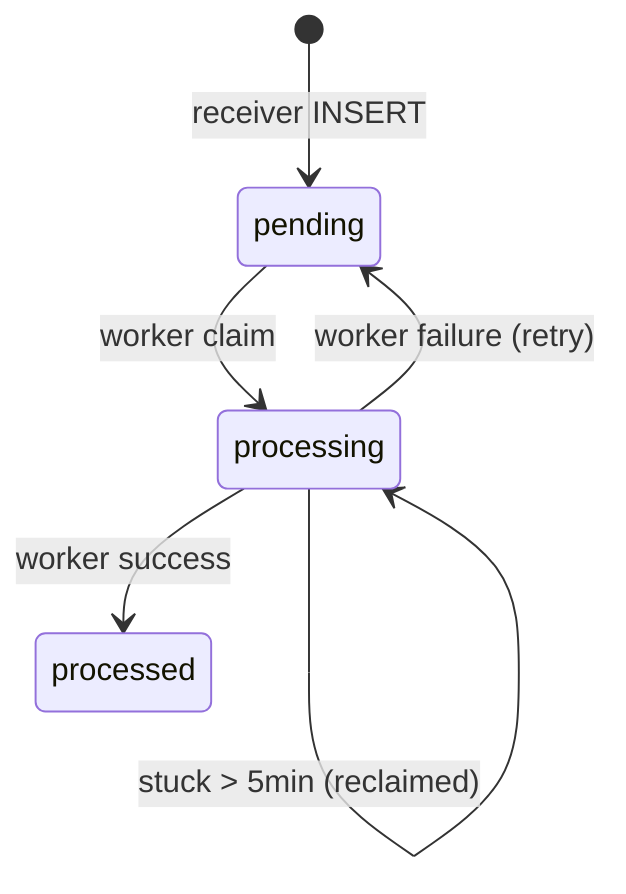

# Webhook Receiver — Sequence Diagram

End-to-end flow of a Stripe webhook from delivery to processed business event.



## Why this shape

The flow has two **independent loops**:

1. **Stripe → Receiver → Queue → 200**: synchronous, must complete in <10 seconds (Stripe timeout). The receiver does only what's cheap and fast.

2. **Worker ↔ Queue ↔ Business DB**: asynchronous, runs on its own polling schedule. Free to take as long as it needs.

The decoupling is what allows the receiver to always return 200 quickly even when business logic is slow or downstream services are unavailable.

## State transitions in `processed_events`



A crashed worker leaves an event in `processing`. The next worker poll will reclaim it after 5 minutes via:

```sql
UPDATE processed_events
SET status = 'processing', claimed_at = datetime('now')
WHERE event_id = ?
  AND (status = 'pending'
       OR (status = 'processing' AND claimed_at < datetime('now', '-5 minutes')))
```

## Failure modes documented in this flow

| Where it can fail | Effect | Recovery |
|---|---|---|
| Receiver crashes before INSERT | Stripe gets timeout → retries | Next attempt processes normally |
| Receiver INSERT fails | Returns 500 → Stripe retries | DB issue must be fixed |
| Worker crashes mid-processing | Event stuck in `processing` | Reclaimed after 5 min |
| Worker INSERT to Business DB fails | Caught → marks event as `pending` again | Retried on next poll |
| Same event sent twice | Second INSERT ignored (`INSERT OR IGNORE`) | Idempotent by design |